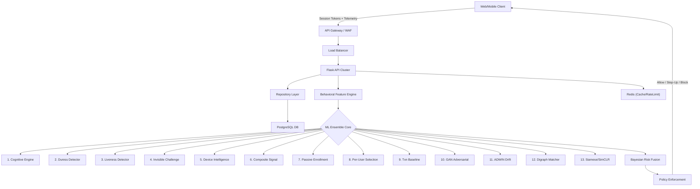

# System Architecture: Behavior-Based Authentication

## 1. High-Level Architecture
The system employs a continuous, behavior-based authentication model integrated with traditional access controls. It evaluates user interactions (keystrokes, mouse movements, device intelligence) in real-time.



## 2. Component Design

### 2.1 Layered Architecture

```
API Routes  →  Services  →  Repositories  →  Database (SQLAlchemy)
```

| Layer | Location | Responsibility |
|-------|----------|---------------|
| **API Routes** | `app/api/` | HTTP request handling, JWT validation, response formatting |
| **Services** | `app/services/` | Business logic, orchestration, ML scoring |
| **Repositories** | `app/repositories/` | Data access, SQL queries, CRUD operations |
| **Database** | `app/database.py` | Connection management, schema initialization |

### 2.2 Repository Pattern

Six repositories decompose the monolithic `DatabaseManager`:

| Repository | Domain | Key Operations |
|-----------|--------|---------------|
| `UserRepository` | User identity | CRUD, password hashing, email verification |
| `SessionRepository` | Session lifecycle | Create, validate, expire, refresh tokens |
| `AuditRepository` | Compliance evidence | Log security events, DPDP consent records |
| `BehavioralRepository` | Biometric data | Store/retrieve keystroke + mouse telemetry |
| `BankingRepository` | Banking features | Beneficiaries, cards, investments, notifications |
| `EnrollmentRepository` | User onboarding | Enrollment state, digraph profiles, device fingerprints |

### 2.3 Feature Extraction Layer
Raw telemetry is buffered in memory. The `BehavioralFeatureEngine` extracts over 200 features from keystroke dynamics (flight time, hold time, rhythm consistency) and mouse pointers (curvature, jerk, deceleration). A BioCatch-style per-user feature selector then picks the top-20 most discriminative features for each user.

### 2.4 Machine Learning Ensemble (13 Engines)
We use a **13-engine ensemble** with **Bayesian belief-update fusion** (log-odds):
- **SimCLR Passive Enrollment**: Silently builds user profiles using contrastive learning over the first 5 sessions.
- **BioCatch-style Feature Selector**: Selects the 20 most unique features per user based on inter-user variance.
- **GAN Adversarial Training**: Uses generative adversarial networks (CTGAN-style) to simulate synthetic behavioral profiles. The discriminator acts as an anti-replay mechanism against automated bots.
- **ADWIN Drift Detector**: Monitors for concept drift (e.g., user getting a new keyboard, hand injury) and automatically retrains models when baseline distribution shifts by >25%.
- **Digraph Matcher**: Bayesian per-key/digraph keystroke profile matching for per-user authentication.
- **Siamese Network**: Twin MLP with contrastive loss for maker-checker behavioral verification.
- **Cognitive Engine**: Multi-class intent detection (APP fraud, duress, bot, account takeover).

### 2.5 Data Storage
- **PostgreSQL**: Stores persistent user profiles, baseline data, encrypted MFA secrets, and transaction history.
- **Redis**: Handles distributed rate-limiting, session context caching, and short-term telemetry buffering.

## 3. Threat Model & Mitigations
- **Credential Stuffing**: Mitigated by Redis rate limiters + progressive lockout (5 attempts → 15-minute cooldown).
- **Session Hijacking**: Blocked by continuous behavioral scoring. A sudden drop in trust score triggers a silent step-up (MFA prompt).
- **Automated Replay Attacks**: Mitigated by HMAC-bound telemetry tokens and GAN entropy analysis. Flat distributions trigger the Liveness detector.
- **Synthetic Identity Fraud**: GAN discriminator detects computer-generated behavioral patterns.
- **Coercion/Duress**: 43-feature stress detector identifies typing under duress.
- **RAT/Remote Access**: Device Intelligence detects remote access tools and emulators.

## 4. Production Readiness
The application is deployed as stateless container instances managed via Docker Compose/Kubernetes. State is strictly pushed to Postgres and Redis, ensuring horizontal scalability. All secrets are managed via strictly validated environment variables. Docker resource limits prevent container resource exhaustion.

## 5. Compliance
| Standard | Implementation |
|----------|---------------|
| RBI Master Directions 2021 | Continuous auth, audit trail, MFA |
| PCI DSS 4.0 | Encryption at rest + in transit, access logging |
| DPDP Act 2023 | Consent records, data minimization, right to erasure |
| GDPR Article 25 | Privacy by design, purpose limitation |
