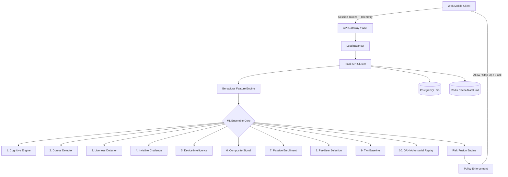

# System Architecture: Behavior-Based Authentication

## 1. High-Level Architecture
The system employs a continuous, behavior-based authentication model integrated with traditional access controls. It evaluates user interactions (keystrokes, mouse movements, device intelligence) in real-time.

## 2. Component Design

### 2.1 Feature Extraction Layer
Raw telemetry is buffered in memory. The `BehavioralFeatureEngine` extracts over 100 features from keystroke dynamics (flight time, hold time, rhythm consistency) and mouse pointers (curvature, jerk, deceleration). 

### 2.2 Machine Learning Ensemble
We use an ensemble of specialized engines:
- **SimCLR Passive Enrollment**: Silently builds user profiles using contrastive learning over the first 5 sessions.
- **BioCatch-style Feature Selector**: Selects the 20 most unique features per user based on inter-user variance.
- **GAN Adversarial Training**: Uses generative adversarial networks (CTGAN-style) to simulate synthetic behavioral profiles. The discriminator acts as an anti-replay mechanism against automated bots.
- **ADWIN Drift Detector**: Monitors for concept drift (e.g., user getting a new keyboard, hand injury) and automatically retrains models when baseline distribution shifts by >25%.

### 2.3 Data Storage
- **PostgreSQL**: Stores persistent user profiles, baseline data, encrypted MFA secrets, and transaction history.
- **Redis**: Handles distributed rate-limiting, session context caching, and short-term telemetry buffering.

## 3. Threat Model & Mitigations
- **Credential Stuffing**: Mitigated by Redis rate limiters.
- **Session Hijacking**: Blocked by continuous behavioral scoring. A sudden drop in trust score triggers a silent step-up (MFA prompt).
- **Automated Replay Attacks**: Mitigated by HMAC-bound telemetry tokens and GAN entropy analysis. Flat distributions trigger the Liveness detector.

## 4. Production Readiness
The application is deployed as stateless container instances managed via Docker Compose/Kubernetes. State is strictly pushed to Postgres and Redis, ensuring horizontal scalability. All secrets are managed via strictly validated environment variables.
