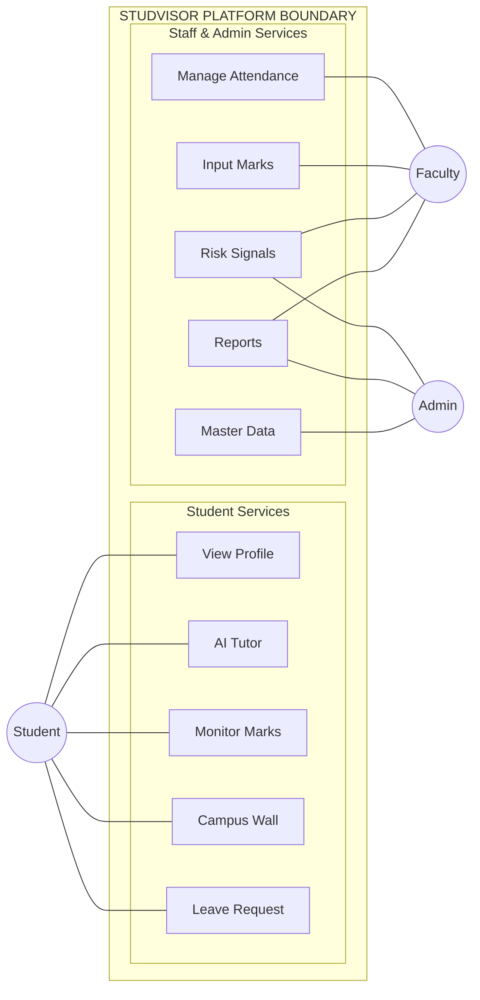
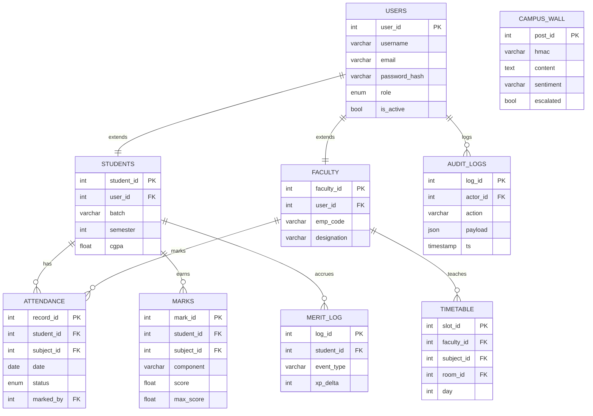
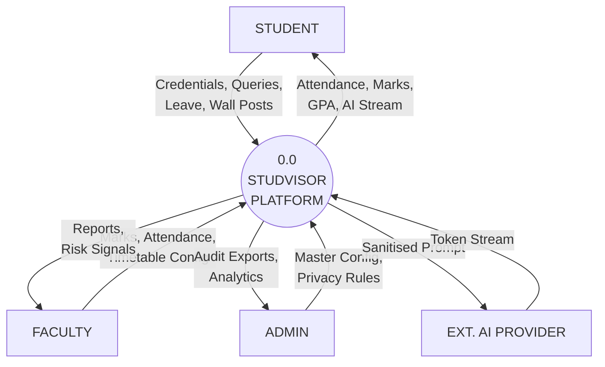
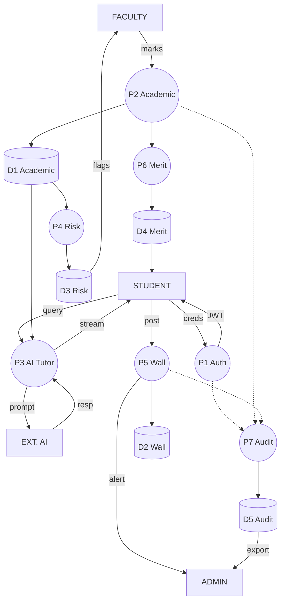
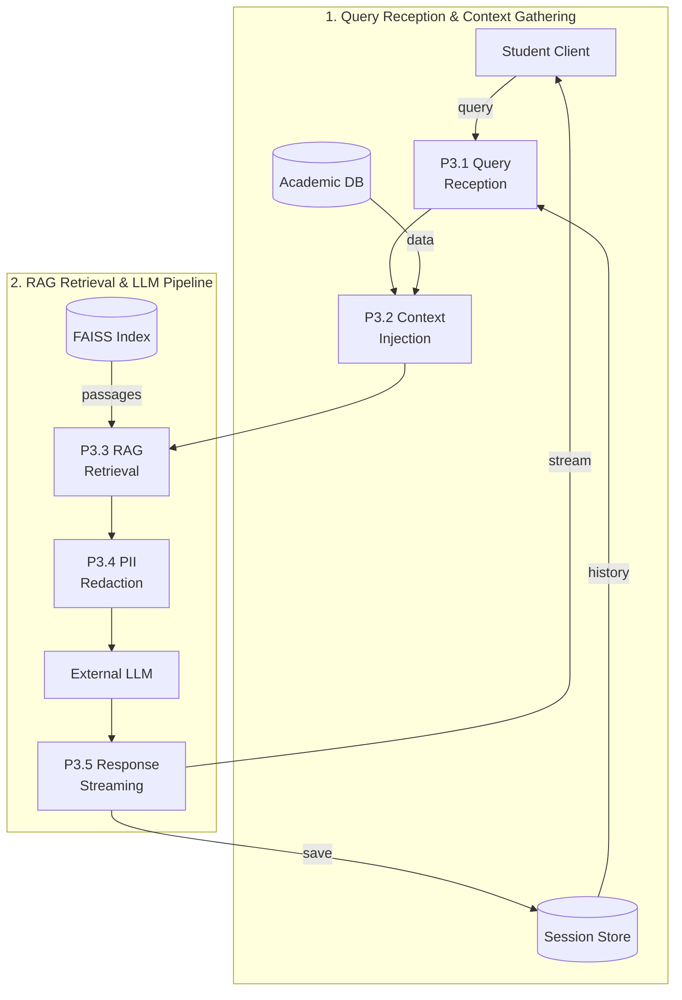
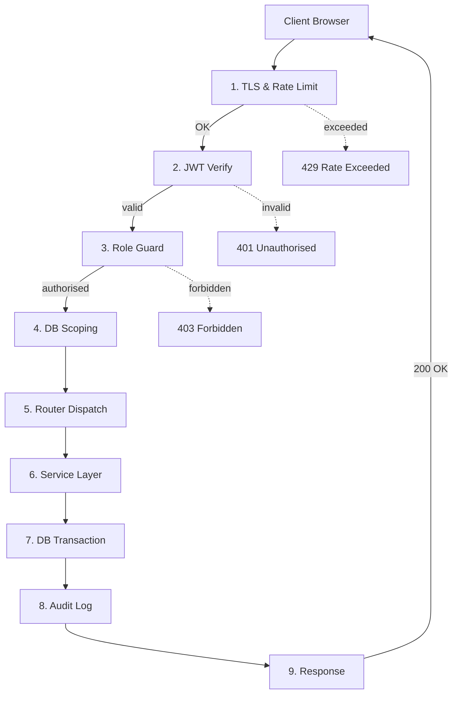

# CHAPTER 3: SYSTEM DESIGN — TECHNICAL DIAGRAMS

### Studvisor Academic & AI-Assisted Advising Platform

---

## 3.3 Figure 3.1: Use-Case Diagram — Studvisor Platform (Landscape Unified Layout)

<b>Click to show/hide raw Mermaid source code</b>

**Actors & Use Cases:**
- **Student (Primary User):** Views academic profiles, interacts with the AI Tutor via contextual chat, monitors attendance and marks in real-time, participates in the Campus Wall, and submits leave applications.
- **Faculty Member / HOD:** Manages classroom attendance with a 24-hour amendment window, inputs and updates internal marks, views AI-generated student risk signals, and generates class-level performance reports.
- **Administrator:** Manages institutional master data, oversees the append-only audit log, configures and monitors the AI engine, and accesses campus analytics dashboards.

---

## 3.4 Figure 3.2: Entity-Relationship Diagram — Studvisor Database Schema

<b>Click to show/hide raw Mermaid source code</b>

**Schema Summary:**
- **Core Identity (RBAC):** `users` maps 1:1 to `students` and `faculty` via polymorphic extension.
- **Academic Subsystem:** `attendance` and `marks` store per-student, per-subject records with faculty audit trails.
- **Gamification:** `merit_log` tracks XP deltas, badge acquisitions, and tier transitions.
- **Campus Wall:** `campus_wall` stores HMAC-anonymised content with rotating daily salts and sentiment labels.
- **Compliance:** `audit_logs` is an immutable, append-only table (INSERT-only permissions) capturing every state-changing operation.

---

## 3.5.1 Figure 3.3: DFD Level 0 — Context Diagram

<b>Click to show/hide raw Mermaid source code</b>

**Context-Level Data Flows:**
- **Student ↔ System:** Submits authentication credentials, academic queries, leave requests, and campus wall posts. Receives attendance logs, marks, GPA roll-ups, AI tutor streaming responses, and social merit updates.
- **Faculty ↔ System:** Inputs timetable settings and marks/attendance entries. Receives aggregate class metrics and student at-risk warnings.
- **Administrator ↔ System:** Feeds master configurations, security parameters, and privacy rule-sets. Retrieves append-only audit files and cohort-level analytics.
- **External AI Provider ↔ System:** Receives sanitised prompt payloads. Returns raw generated token streams.

---

## 3.5.2 Figure 3.4: DFD Level 1 — Major Backend Flows

<b>Click to show/hide raw Mermaid source code</b>

The Level 1 Data Flow Diagram (DFD) maps the major backend operations of the Studvisor platform by breaking down the central orchestrator into seven key processes (P1 through P7). Users interact with these processes using specific secure credentials, which are verified by Process P1 to distribute JWT tokens and establish safe sessions. Core academic entries such as attendance data, marks, and timetable updates are managed through Process P2 and stored permanently within Data Store D1. Process P3 acts as the AI tutoring engine, extracting profile context from Data Store D1 to generate grounded queries for the external LLM provider. Predictive computation occurs in Process P4, which scans grade and attendance trends to write at-risk flags to Data Store D3 and alert faculty members in real time. Finally, Processes P5 and P6 handle anonymous campus wall contributions and student gamification merits respectively, while Process P7 writes immutable state-change records to Data Store D5 for comprehensive audit compliance.

**Process Summary (P1–P7):**

| Process | Input Data Flows | Output Data Flows |
|:--------|:-----------------|:------------------|
| **P1: User Authentication** | username, password, device_fingerprint | JWT access + refresh tokens; Auth event → audit_logs |
| **P2: Academic Data Management** | Attendance, marks, timetable from Faculty | Updated records → D1; Risk signal recalculation triggered |
| **P3: AI Tutor Interaction** | student_id, session_id, query_text | Sanitised prompt → AI Provider; SSE stream → Student |
| **P4: Predictive Risk Computation** | Attendance slope, grade trend from D1 | Risk scores → D3; At-risk flags → Faculty dashboard |
| **P5: Campus Wall Processing** | Post submission, reactions | HMAC-tagged post → D2; Escalation → Admin alert queue |
| **P6: Merit & Gamification** | Academic actions | XP delta → D4; Badge events → Campus Wall widget |
| **P7: Audit & Compliance** | State-changing requests intercepted | Append-only record → D5; Admin audit export |

---

## 3.5.3 Figure 3.5: DFD Level 2 — AI Tutoring Sub-Process (P3)

<b>Click to show/hide raw Mermaid source code</b>

**AI Pipeline Walkthrough:**
1. **P3.1 (Query Reception):** Intercepts the inbound query, verifies the session token, and pulls conversational history from the Redis Session Store.
2. **P3.2 (Academic Context Injection):** Queries the student's marks and risk signals from D1: Academic Database and appends them to the system prompt to ground the AI's response.
3. **P3.3 (RAG Retrieval):** Embeds the user query and searches the FAISS Vector Index for top-k course notes, syllabi, and faculty-uploaded materials.
4. **P3.4 (PII Redaction):** Applies regex-based filters to scrub student names, registration IDs, email addresses, and phone numbers from the prompt before external transmission.
5. **P3.5 (Response Streaming):** Consumes raw SSE tokens from the LLM, streams them to the Student Client in real-time, and persists the final transcript in the Session Store.

---

## 3.6 Figure 3.6: System Flow Diagram (SFD) — Request Life Cycle

<b>Click to show/hide raw Mermaid source code</b>

**Request Lifecycle Walkthrough:**

| Step | Layer | Description |
|:-----|:------|:------------|
| **1** | Security | HTTPS request enters; SlowAPI checks IP rate (200 req/min). Exceeding returns `429`. |
| **2** | Security | JWT dependency extracts Bearer token, verifies signature and expiry. Failure returns `401`. |
| **3** | Security | Role claim is checked against endpoint requirement. Mismatch returns `403`. |
| **4** | Application | Scope helper appends `WHERE` clause filter to constrain DB queries to the authenticated principal. |
| **5** | Application | FastAPI routes request to the correct domain router (academic, campus, user, staff). |
| **6** | Application | Route handler delegates all business logic to the corresponding service module. |
| **7** | Persistence | SQLAlchemy session executes DB operations; committed on success, rolled back on exception. |
| **8** | Compliance | AuditLogMiddleware intercepts state-changing responses and appends an immutable JSON diff record. |
| **9** | Response | Pydantic model serialises the result and returns the appropriate HTTP status code to the client. |

---

*Studvisor System Design — Chapter 3 Technical Diagrams © 2026*

